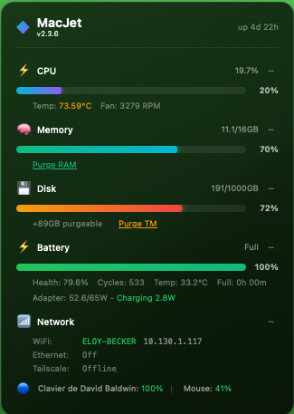

# MacJet

A beautiful glassmorphism system monitor widget for macOS desktop.



**Author:** B4E SRL - David Baldwin
**License:** MIT
**Version:** 2.3.6

## Features

- **CPU** - Usage percentage, temperature, fan speed (RPM), thermal throttling indicator
- **Memory** - Used/total GB, one-click RAM purge
- **Disk** - Free/total GB, purgeable space, one-click Time Machine snapshot cleanup
- **Battery** - Percentage, status, health, cycle count, temperature, time estimates
- **Power** - Adapter usage/capacity, charging power, discharge rate on battery
- **Network** - WiFi SSID/IP, Ethernet IP, Tailscale VPN status
- **Bluetooth** - Battery levels for connected devices (Keyboard, Mouse, Trackpad, AirPods)
- **Uptime** - System uptime display

### UI Features

- Glassmorphism design with backdrop blur
- Gradient progress bars with glow effects
- Click sections to expand/collapse for additional details
- Persistent expand/collapse state via localStorage
- Configurable scale (zoom) and screen position
- Version display in header

## Installation

### Quick Install

```bash
./install-widget.sh
```

This script will:
1. Check for and install Xcode Command Line Tools if needed
2. Download and install Übersicht if not present
3. Copy the widget to the correct location
4. Configure Übersicht to start on login
5. **Optionally enable advanced features** (see below)
6. Launch Übersicht

### Advanced Features (Optional)

During installation, you'll be asked if you want to enable advanced features:

| Feature | What it enables | Requires |
|---------|-----------------|----------|
| CPU Temperature | Shows CPU temp (e.g., 73.59°C) | `powermetrics` |
| Fan Speed | Shows fan RPM (e.g., 3279 RPM) | `powermetrics` |
| Purge RAM | One-click memory cache clear | `purge` |
| Purge TM | One-click Time Machine snapshot deletion | `tmutil` |

This requires adding passwordless sudo permissions. You'll be prompted for your password once during installation. The configuration is stored in `/etc/sudoers.d/macjet`.

**Without advanced features:** CPU temp/fan won't show, and purge buttons will show "Manage" link to System Settings instead.

To remove advanced features later:
```bash
sudo rm /etc/sudoers.d/macjet
```

### Manual Installation

1. **Install Übersicht:**
   Download from https://tracesof.net/uebersicht/

2. **Copy widget:**
   ```bash
   mkdir -p ~/Library/Application\ Support/Übersicht/widgets
   cp -r ubersicht-widget ~/Library/Application\ Support/Übersicht/widgets/macjet
   ```

3. **Launch Übersicht:**
   ```bash
   open -a Übersicht
   ```

## Configuration

Edit `macjet.jsx` and modify the configuration section at the top:

```javascript
// Refresh interval in milliseconds
export const refreshFrequency = 5000;

// Scale factor: 1.0 = 100%, 1.2 = 120%, 0.8 = 80%
const SCALE = 1.0;

// Position: 'bottom-left', 'bottom-right', 'top-left', 'top-right'
const POSITION = 'bottom-left';
```

### Scale Examples

- `SCALE = 0.8` - 80% size (smaller)
- `SCALE = 1.0` - 100% size (default)
- `SCALE = 1.2` - 120% size (larger)
- `SCALE = 1.5` - 150% size (much larger)

### Position Options

- `'bottom-left'` - Bottom left corner (default)
- `'bottom-right'` - Bottom right corner
- `'top-left'` - Top left corner
- `'top-right'` - Top right corner

## Interactive Features

### Expandable Sections

Click on any section header to expand/collapse additional details:

| Section | Expanded Details |
|---------|------------------|
| CPU | Temperature, Fan speed |
| Memory | Purge RAM button |
| Disk | Purgeable space, Purge TM button |
| Battery | Health %, Cycles, Temperature, Time estimate, Adapter info |
| Network | WiFi details, Ethernet IP, Tailscale status |

### Purge Buttons

When advanced features are enabled:

- **Purge RAM** (Memory section, green) - Clears inactive memory cache (`sudo purge`)
- **Purge TM** (Disk section, orange) - Deletes all Time Machine local snapshots

**Note:** Disk "purgeable" space includes:
- Time Machine local snapshots (cleared by Purge TM)
- iCloud downloaded files (managed automatically by macOS)
- System caches (managed automatically by macOS)
- Some APFS snapshots may be protected by the system and cannot be deleted

## Tools Included

### 1. Desktop Widget (`ubersicht-widget/macjet.jsx`)

The main widget for Übersicht that displays on your desktop.

### 2. Terminal Dashboard (`power_monitor.py`)

A curses-based terminal dashboard with live updating display.

```bash
python3 power_monitor.py
```

**Controls:**
- `q` - Quit
- `r` - Force refresh

## Requirements

- macOS 10.15 (Catalina) or later
- Python 3 (included with macOS)
- Übersicht (for desktop widget)

### Optional

- **Xcode Command Line Tools** - For accurate disk purgeable space (falls back to `df` if not installed)
- **Tailscale** - For VPN status display

## Technical Details

### Data Sources

| Metric | Source |
|--------|--------|
| CPU Usage | `top -l 1` |
| CPU Temp/Fan | `sudo powermetrics` |
| Memory | `vm_stat`, `sysctl hw.memsize` |
| Disk | Swift `URLResourceKey.volumeAvailableCapacityForImportantUsageKey` |
| Battery | `ioreg -rn AppleSmartBattery` |
| Power | `ioreg` (SystemPowerIn, Amperage, Voltage) |
| Network | `ipconfig`, `system_profiler SPAirPortDataType` |
| Tailscale | `/Applications/Tailscale.app/Contents/MacOS/Tailscale status` |
| Bluetooth | `ioreg -r -k BatteryPercent` |
| Thermal | `pmset -g therm` |
| Uptime | `sysctl kern.boottime` |

### Power Calculations

- **On AC**: Adapter total from `SystemPowerIn`, charging power from `Amperage × Voltage`
- **On Battery**: Discharge power from `InstantAmperage × Voltage` (handles unsigned 64-bit conversion)

Display format:
- On AC: `Adapter: 52.6/65W - Charging 2.8W`
- On Battery: `Discharge: 35W`

### Disk Space

Uses Swift's `volumeAvailableCapacityForImportantUsageKey` for accurate APFS reporting that includes purgeable space, matching what Finder shows. Falls back to `df` command on Macs without Xcode Command Line Tools.

## Troubleshooting

### Widget not showing

1. Check Übersicht is running (menu bar icon)
2. Click menu bar icon → "Refresh All Widgets"
3. Check for errors: menu → "Open Widgets Folder" → right-click widget → "Show Debug Console"

### CPU temp/fan not showing

Run the installer and select "y" for advanced features, or manually add to sudoers:
```bash
echo "$USER ALL=(ALL) NOPASSWD: /usr/bin/powermetrics" | sudo tee -a /etc/sudoers.d/macjet
```

### Purge buttons show "Manage" instead

Advanced features not enabled. Run installer again and select "y", or manually add:
```bash
echo "$USER ALL=(ALL) NOPASSWD: /usr/sbin/purge, /usr/bin/tmutil" | sudo tee -a /etc/sudoers.d/macjet
```

### Tailscale shows "Offline" when connected

Ensure the Tailscale app is running. The widget checks `tailscale status` command.

### Battery time shows "calculating..."

macOS takes a few minutes to calculate time estimates after unplugging or when power usage fluctuates.

### Adapter shows less than rated wattage

USB-C adapters throttle their output when they overheat. A 100W adapter may report 65W or 45W when hot.

### Purgeable space doesn't decrease after Purge TM

Some purgeable space is from iCloud files and system caches that macOS manages automatically. Some APFS snapshots may be protected by the system (e.g., before macOS updates) and cannot be deleted.

## Uninstall

```bash
rm -rf ~/Library/Application\ Support/Übersicht/widgets/macjet
sudo rm /etc/sudoers.d/macjet  # If advanced features were enabled
```

Optionally remove Übersicht:
```bash
rm -rf /Applications/Übersicht.app
```

## License

MIT License - Copyright (c) 2025 B4E SRL - David Baldwin

See [LICENSE](LICENSE) for details.
