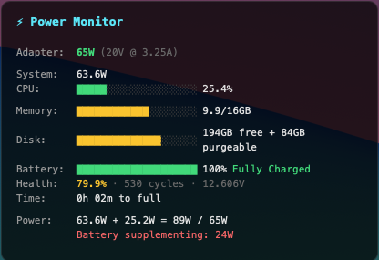

# MacJet

A beautiful glassmorphism system monitor widget for macOS desktop.



**Author:** B4E SRL - David Baldwin
**License:** MIT
**Version:** 2.3.3

## Features

- **CPU** - Usage percentage, temperature, fan speed (idle/RPM), thermal throttling indicator
- **Memory** - Used/total with purgeable memory accounted for
- **Disk** - Free/total with purgeable space, one-click purge (Swift API with `df` fallback)
- **Battery** - Percentage, status, health, cycle count, temperature, time estimates
- **Power** - Adapter usage/capacity, charging power, discharge rate on battery
- **Network** - WiFi SSID/IP, Ethernet IP, Tailscale VPN status
- **Bluetooth** - Battery levels for Magic Mouse, Keyboard, Trackpad, AirPods
- **Uptime** - System uptime display

### UI Features

- Glassmorphism design with backdrop blur
- Gradient progress bars with glow effects
- Click sections to expand/collapse for additional details
- Persistent settings via localStorage
- Configurable scale (zoom) and screen position

## Installation

### Quick Install

```bash
./install-widget.sh
```

This script will:
1. Check for and install Xcode Command Line Tools if needed
2. Download and install Übersicht if not present
3. Copy the widget to the correct location
4. Configure Übersicht to start on login
5. Launch Übersicht

### Manual Installation

1. **Install Übersicht:**
   Download from https://tracesof.net/uebersicht/

2. **Copy widget:**
   ```bash
   mkdir -p ~/Library/Application\ Support/Übersicht/widgets
   cp -r ubersicht-widget ~/Library/Application\ Support/Übersicht/widgets/macjet
   ```

3. **Launch Übersicht:**
   ```bash
   open -a Übersicht
   ```

## Configuration

Edit `macjet.jsx` and modify the configuration section at the top:

```javascript
// =============================================================================
// CONFIGURATION
// =============================================================================

// Refresh interval in milliseconds
export const refreshFrequency = 5000;

// Scale factor: 1.0 = 100%, 1.2 = 120%, 0.8 = 80%
const SCALE = 1.0;

// Position: 'bottom-left', 'bottom-right', 'top-left', 'top-right'
const POSITION = 'bottom-left';
```

### Scale Examples

- `SCALE = 0.8` - 80% size (smaller)
- `SCALE = 1.0` - 100% size (default)
- `SCALE = 1.2` - 120% size (larger)
- `SCALE = 1.5` - 150% size (much larger)

### Position Options

- `'bottom-left'` - Bottom left corner (default)
- `'bottom-right'` - Bottom right corner
- `'top-left'` - Top left corner
- `'top-right'` - Top right corner

## Tools Included

### 1. Desktop Widget (`ubersicht-widget/macjet.jsx`)

The main widget for Übersicht that displays on your desktop.

### 2. Terminal Dashboard (`power_monitor.py`)

A curses-based terminal dashboard with live updating display.

```bash
python3 power_monitor.py
```

**Controls:**
- `q` - Quit
- `r` - Force refresh

## Requirements

- macOS 10.15 (Catalina) or later
- Python 3 (included with macOS)
- Übersicht (for desktop widget)

### Optional

- **Xcode Command Line Tools** - For accurate disk purgeable space (falls back to `df` if not installed)
- **Tailscale** - For VPN status display
- **CPU temperature & fan speed** - Requires one of:
  - `osx-cpu-temp` via Homebrew: `brew install osx-cpu-temp`
  - Or configure passwordless sudo for powermetrics (see below)

### Enabling CPU Temperature & Fan Speed

To enable CPU temp and fan speed without Homebrew, configure sudo to allow `powermetrics` without a password:

```bash
sudo visudo
```

Add this line at the end (replace `yourusername` with your actual username):

```
yourusername ALL=(ALL) NOPASSWD: /usr/bin/powermetrics
```

Save and exit. The widget will automatically detect and display CPU temperature and fan speed on next refresh.

### Enabling One-Click Disk Purge

To enable purging disk cache directly from the widget (instead of opening Storage settings), add purge permissions:

```bash
sudo visudo
```

Add this line (replace `yourusername` with your actual username):

```
yourusername ALL=(ALL) NOPASSWD: /usr/sbin/purge, /usr/bin/tmutil
```

Save and exit. The widget will detect this and clicking "+XGB purgeable" will run purge directly.

## Technical Details

### Data Sources

| Metric | Source |
|--------|--------|
| CPU Usage | `top -l 1` |
| Memory | `vm_stat`, `sysctl hw.memsize` |
| Disk | Swift `URLResourceKey.volumeAvailableCapacityForImportantUsageKey` |
| Battery | `ioreg -rn AppleSmartBattery` |
| Power | `ioreg` (SystemPowerIn, ChargingCurrent, ChargingVoltage) |
| Network | `ipconfig`, `system_profiler SPAirPortDataType` |
| Tailscale | `/Applications/Tailscale.app/Contents/MacOS/Tailscale` CLI |
| Bluetooth | `ioreg -r -k BatteryPercent` |
| Thermal | `pmset -g therm` |
| Uptime | `sysctl kern.boottime` |

### Power Calculations

- **On AC**: Adapter total from `SystemPowerIn`, charging power from `ChargingCurrent × ChargingVoltage`
- **On Battery**: Discharge power from `InstantAmperage × Voltage` (handles unsigned 64-bit conversion)

Display format:
- On AC: `Adapter: 47/65W - Charging 25W`
- On Battery: `Discharge: 35W`

### Disk Space

Uses Swift's `volumeAvailableCapacityForImportantUsageKey` for accurate APFS reporting that includes purgeable space, matching what Finder shows. Falls back to `df` command on Macs without Xcode Command Line Tools (purgeable space won't be shown).

## Troubleshooting

### Widget not showing

1. Check Übersicht is running (menu bar icon)
2. Click menu bar icon → "Refresh All Widgets"
3. Check for errors: menu → "Open Widgets Folder" → right-click widget → "Show Debug Console"

### Tailscale shows "Offline" when connected

The widget checks `tailscale status` command. If Tailscale is connected but shows offline, ensure the Tailscale app is running.

### Battery time shows "calculating..."

macOS takes a few minutes to calculate time estimates after unplugging or when power usage fluctuates. The widget shows "calculating..." until macOS provides an estimate.

### Adapter shows less than rated wattage

USB-C adapters throttle their output when they overheat. A 100W adapter may report 65W or 45W when hot. Let it cool down to restore full capacity.

### Memory/Disk values seem wrong

The tools use macOS APIs for accurate reporting including purgeable space. Verify with:

```bash
# Check memory
vm_stat

# Check disk (shows purgeable)
diskutil info / | grep -E "(Total|Available|Purgeable)"
```

## Uninstall

```bash
rm -rf ~/Library/Application\ Support/Übersicht/widgets/macjet
```

Optionally remove Übersicht:
```bash
rm -rf /Applications/Übersicht.app
```

## License

MIT License - Copyright (c) 2025 B4E SRL - David Baldwin

See [LICENSE](LICENSE) for details.
